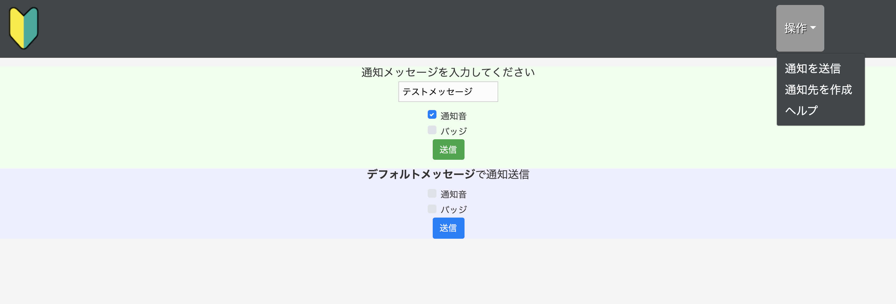

# sns
Grails練習用アプリ AmazonWebServiceのSimpleNotificationServiceを使ってみる。

## 機能
### Grails側
* 通知を送信
    * 任意の文字列か、あらかじめ設定しておいた文字列の通知を送信できる
    * メールアドレスに通知メッセージを送信できる
    * iOS端末に、プッシュメッセージを送信できる
        * 通知音あり or なし を設定できる
        * バッジあり or なし を設定できる
* 通知先を作成
    * 通知先のメールアドレスを追加できる
* ヘルプ
    * エラー対応など
### iOS側
* 端末のデバイストークンを登録できる
* 通知を受信できる
## 構成図

## 課題・問題
* AWS-SNSの一部の機能しか使えてないので今後他の機能も使いこなす。
## 謝辞
* [Frame illust](https://frame-illust.com/)
    * 初心者（若葉）マークの画像を使用させていただきました。
* [Takahiro Octopress Blog](https://grandbig.github.io/blog/2019/09/28/ios-devicetoken-2/)
    * Swiftでのデバイストークン取得のコードを参考にさせていただきました。
## 備考
### アプリを実行した時に、下記のようなエラーが発生する
```
Failed to register to APNs: Error Domain=NSCocoaErrorDomain Code=3000 "Appの有効な“aps-environment”エンタイトルメント文字列が見つかりません" UserInfo={NSLocalizedDescription=Appの有効な“aps-environment”エンタイトルメント文字列が見つかりません}
```
* Xcode > Signing & Capabilities に Push Notificationsが登録されていない可能性
    * 登録されていなければ、PushNotificationsを追加する
    * 開発者登録（有償）をしていないと、Push Notificationsは利用できない


