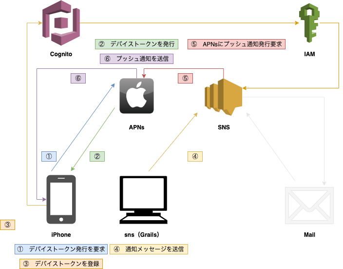

# sns
Grails練習用アプリ AmazonWebServiceのSimpleNotificationServiceを使ってみる。

## 動作条件
### プッシュ通知の動作確認を行うためには、下記の項目を全て満たしている必要があります
* Grailsの環境導入が済んでいること
* AWSのアカウントを所持していること
* Appleの開発者登録をしていること
* iOS実機を所持していること
* Macを所持していること
## 準備
### リポジトリをクローンする
1. 任意の場所に、リポジトリをクローンする
```
$ git clone https://github.com/KonoLevel1/Grails_AWS_SNS4.git
```
### メール通知を行えるようにする
1. AWS公式サイトにサインイン後「SNS」でサービスを検索する
    * 「SimpleNotificationService」は通知を行うサービスです
2. 画面左側より「トピック」を選択し、「トピックの作成」を行う
3. 「名前」「表示名」を入力し、他項目は必要に応じて設定する（必要なければ触らなくて良い）
4. 作成したトピックの名前の右に「ARN」が表示されているので、ARNをコピーする

5. クローンした「Grails_AWS_SNS4 > sns」をIDE（統合開発環境）などで開く
6. 「sns > grails-app[main] > conf > application.yml」を表示し、topicArnに、コピーしたARNを貼り付ける
7. Grailsをローカルで起動する
```
$ grails run-app
```
8. http://localhost:8080 にアクセスして、画面右上の「操作 > 通知先を作成」より、通知を送りたいメールアドレスを登録する

9. 通知許可メールが送信されるので、メールを開き、Confirm subscription　より通知を許可する
10. http://localhost:8080 にアクセスして、「操作　 > 通知を送信」より、通知を送信する。
    * 通知音とバッジはメール送信では使用できません
11. メールが届けば成功
### プッシュ通知を行えるようにする 
#### CSRファイルの生成
1. キーチェーンアクセスを開き、画面上「キーチェーンアクセス > 証明書アシスタント > 認証局に証明書を要求」
2. 「ユーザーのメールアドレス」を入力、「通称」はそのまま、「ディスクに保存」を選択、「鍵ペア情報を指定」にチェック
3. 「鍵のサイズ」は2048ビット、アルゴリズムは「RSA」で続ける
#### 開発用証明書の生成
1. https://developer.apple.com/account/ にアクセスして、「Certificates, Identifiers & Profiles」をクリック
2. 「Certificates」横の青いプラスボタンをクリック
3. 「iOS App Development」を選択し、画面右上より「Continue」
4. 「Choose File」より先程生成した「CertificateSigningRequest.certSigningRequest」を選択し「Continue」
5. 「開発者証明書」を「Download」する
#### AppIDの生成（AppleIDではないので注意）
1. https://developer.apple.com/account/ にアクセスして、「Certificates, Identifiers & Profiles」をクリック
2. 「Identifiers」をクリックして「Identifiers」横の青いプラスボタンをクリック
3. 「App IDs」を選択し「Continue」
4. 「App」を選択し「Continue」
5. 「Description」にアプリの説明を入力、「Bundle ID」は「Explicit」を選択し任意のIDを入力する
    * Bundle ID は、他のアプリと被っていたら使用できないので、被らないものを入力する必要がある
6. 「Capabilities」より「Push Notifications」を選択し、画面右上より「Continue」「Register」
#### デバイスの登録
1. 画面左より「Devices」をクリックして「Devices」横の青いプラスボタンをクリック
2. 「Platform」に iOS,tvOS,watchOS を選択、「Device Name」に任意の名前
3. iPhoneなどの端末をMacに接続した状態で、Xcodeを開き、画面上より「Window > Devices and Simulators」
4. Identifierの文字列をコピーして、「Device ID（UDID）」に入力して「Continue」
#### プロビジョニングプロファイルの生成
1. 画面左より「Profiles」をクリックして「Profiles」横の青いプラスボタンをクリック
2. 「iOS App Development」を選択し「Continue」
3. 「App ID」は先程作ったものを選択し「Continue」
4. 開発証明書を選択し「Continue」
5. 端末を選択し「Continue」
6. 任意のプロビジョニングプロファイルネームを入力し「Generate」し「Download」
#### Cognitoの設定
1. AWS公式サイトにサインイン後「Cognito」でサービスを検索する
    * 「SimpleNotificationService」は通知を行うサービスです
2. IDプールの管理をクリック
3. 新しいIDプールの作成をクリック
4. 「IDプール名」に任意の文字列を入力する
5. 「認証されていないIDに対してアクセスを有効にする」をチェック
6. 「プールの作成」をクリック
7. 「詳細を表示」をクリックしロール名を確認して（基本的に変更不要）「許可」
8. 「プラットフォーム」に iOS - Swiftを設定して
## 機能
### Grails側
* 通知を送信
    * 任意の文字列か、あらかじめ設定しておいた文字列の通知を送信できる
    * メールアドレスに通知メッセージを送信できる
    * iOS端末に、プッシュメッセージを送信できる
        * 通知音あり or なし を設定できる
        * バッジあり or なし を設定できる
* 通知先を作成
    * 通知先のメールアドレスを追加できる
* ヘルプ
    * エラー対応など
### iOS側
* 端末のデバイストークンを登録できる
* 通知を受信できる
## 構成図

## 課題・問題
* AWS-SNSの一部の機能しか使えてないので今後他の機能も使いこなす。
## 謝辞
* [Frame illust](https://frame-illust.com/)
    * 初心者（若葉）マークの画像を使用させていただきました。
* [Takahiro Octopress Blog](https://grandbig.github.io/blog/2019/09/28/ios-devicetoken-2/)
    * Swiftでのデバイストークン取得のコードを参考にさせていただきました。
* [[Swift]AWS SNSでiOSにPush通知する
](https://qiita.com/Necorin/items/689053f3a1ae576ff71a)
    * Swiftでデバイストークン登録のコードを参考にさせていただきました。
## 備考
### アプリを実行した時に、下記のようなエラーが発生する
```
Failed to register to APNs: Error Domain=NSCocoaErrorDomain Code=3000 "Appの有効な“aps-environment”エンタイトルメント文字列が見つかりません" UserInfo={NSLocalizedDescription=Appの有効な“aps-environment”エンタイトルメント文字列が見つかりません}
```
* Xcode > Signing & Capabilities に Push Notificationsが登録されていない可能性
    * 登録されていなければ、PushNotificationsを追加する
    * 開発者登録（有償）をしていないと、Push Notificationsは利用できない


